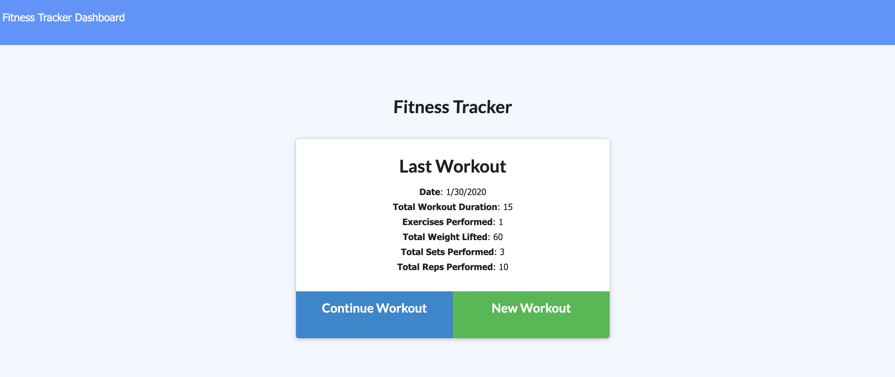

# Progressive Web App (PWA) - Fitness Tracker
******************************************************************************************************************************
## Progressive Web Apps
PWA's or Progressive Web Apps are a web application that look and behave like a mobile app and take advantage of mobile app features. 
******************************************************************************************************************************
## User Story
As an avid traveller and fitness enthusiast 

I want to be able to view, create, and track daily workouts with or without a data/internet connection 

So that I can gauge my progress when I am traveling

## Description and Usage
This tracker allows users to record and track their exercises and compare their stats over time with or without a data/internet connection. 

To begin tracking your workouts, click the 'New Workout' button and select the exercise type; resistance or cardio. Next, complete the form with your workout details and click 'Add Exercise'. Clicking the 'Complete' button will bring you to the Fitness Tracker main page. Upon returning to the main page, you will see a summary of your last workout. You can choose to continue adding to your last workout by clicking 'Continue Workout' or you can create a whole new workout by clicking the 'New Workout' button.

If you would like to view your workout stats, click the 'Dashboard' link in the top left corner of the Fitness Tracker main page. This dashboard allows you to see your progress over time.

[Click here to try the PWA Fitness Tracker!](https://pwa-fitness-tracker.herokuapp.com/)

## Technology
* Manifests
* Service Workers
* Cache API

## What I Learned
I learned many new concepts and skills while creating this PWA fitness tracker. A few of which include:
* The benefits of a PWA
  - Fast
  - Reliable
  - Can be used while on or offline
* How to turn a regular web application into a PWA
